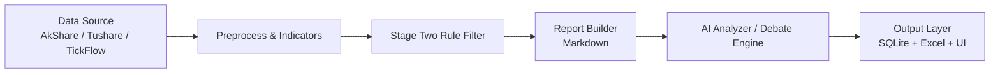
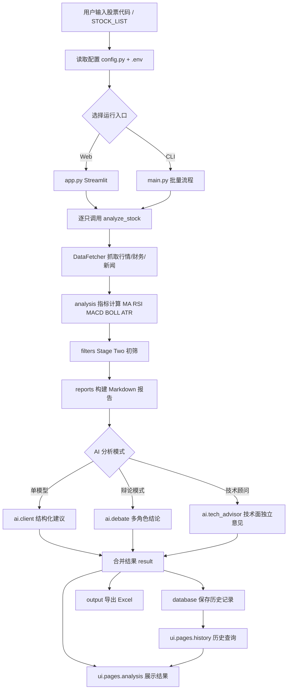

# StockScreener AI

> 面向 A 股研究与选股流程自动化的 Python 项目：数据抓取 + 技术指标 + 规则筛选 + AI 解读 + 可视化分析 + 历史归档。

---

## 目录

- [项目定位](#项目定位)
- [指标体系与理论依据](#指标体系与理论依据)
- [核心能力](#核心能力)
- [系统架构](#系统架构)
- [项目结构](#项目结构)
- [环境要求](#环境要求)
- [安装与初始化](#安装与初始化)
- [配置说明](#配置说明)
- [运行方式](#运行方式)
- [输出结果说明](#输出结果说明)
- [推荐工作流](#推荐工作流)
- [性能与稳定性建议](#性能与稳定性建议)
- [常见问题](#常见问题)
- [安全与开源发布规范](#安全与开源发布规范)
- [Roadmap](#roadmap)
- [免责声明](#免责声明)

---

## 项目定位

`StockScreener AI` 旨在把“手工盯盘 + 经验判断”的流程，整理为可重复执行的研究流水线，适用于以下场景：

- 对股票池进行批量初筛，快速定位值得进一步研究的标的
- 将行情、技术指标、形态信号汇总成统一 Markdown 报告
- 让 AI 在统一上下文中给出结构化建议，降低信息遗漏
- 通过可视化页面复盘分析结果，沉淀历史记录与研究素材

---

## 指标体系与理论依据

本项目默认采用“趋势 + 动量 + 波动 + 形态”的组合框架，兼顾方向判断与风险识别。

### 1) 趋势类

- `MA50 / MA150 / MA200`
- `EMA`
- 52 周区间位置（用于强弱分层）

### 2) 动量类

- `RSI(14)`
- `MACD(12,26,9)` 与金叉/死叉信号

### 3) 波动率类

- `BOLL(20,2)`
- `ATR(14)`

### 4) K 线形态

- 十字星、锤子线、上吊线
- 看涨/看跌吞没、孕线
- 启明星/黄昏星
- 刺透形态/乌云盖顶

### 5) 理论参考书目

1. *How to Make Money in Stocks* — William J. O'Neil（CAN SLIM）
2. *Technical Analysis of the Financial Markets* — John J. Murphy
3. *Japanese Candlestick Charting Techniques* — Steve Nison
4. *Trading for a Living* — Alexander Elder
5. 《股票大作手回忆录》— Edwin Lefevre

---

## 核心能力

### 规则筛选

- 内置 Stage Two 趋势初筛（均线结构 + 中长期位置关系）
- 支持股票池批量处理与限制样本调试（`--limit`）

### 报告生成

- 自动聚合行情、技术指标、信号结论
- 输出标准化 Markdown，便于 AI 消化与人工复盘

### AI 分析

- 支持 OpenAI 兼容接口风格的多家 Provider
- 支持“单分析师模式”与“多角色辩论模式”
- 返回结构化结果，便于落库与导出

### 可视化与数据沉淀

- Streamlit 页面支持交互式分析与历史查询
- SQLite 存储历史结果，支持后续因子挖掘
- Excel 导出便于外部复核与分享

---

## 界面预览

> 以下图片默认使用项目根目录相对路径。

### 主界面


### 历史记录


### 支持作者


---

## 系统架构



设计原则：

- **模块解耦**：数据、策略、AI、展示相互独立
- **可替换**：数据源和 AI Provider 可以按配置替换
- **可追溯**：结果可落库并导出，便于复盘和审计

---

## 项目整体逻辑图



---

## 项目结构

| 路径 | 说明 |
|------|------|
| `main.py` | 批量分析主入口（CLI） |
| `app.py` | Streamlit 应用入口 |
| `run_app.py` | 自动端口 + 浏览器启动器 |
| `config.py` | 全局配置中心 |
| `data/` | 数据抓取与数据源适配 |
| `analysis/` | 技术指标与技术分析逻辑 |
| `filters/` | 筛选规则（含 Stage Two） |
| `reports/` | 报告组装与 Markdown 构建 |
| `ai/` | AI 客户端、Prompt、辩论机制 |
| `output/` | 导出逻辑（Excel 等） |
| `database/` | SQLite 管理与读写 |
| `ui/` | Streamlit 页面模块 |
| `factor_mining/` | 因子挖掘与研究辅助 |
| `tests/` | 测试代码 |

---

## 环境要求

- Python `3.10+`（推荐 `3.11`）
- Windows / macOS / Linux
- 推荐使用虚拟环境

---

## 安装与初始化

### 1) 创建虚拟环境

```powershell
python -m venv .venv
.\.venv\Scripts\Activate.ps1
```

### 2) 安装依赖

```powershell
pip install -r requirements.txt
```

### 3) 准备配置

```powershell
copy .env.example .env
```

随后按需填写 `.env` 中的本地配置（密钥仅保留在本地）。

---

## 配置说明

常用环境变量如下：

| 变量 | 说明 |
|------|------|
| `DATA_SOURCE` | 主数据源（如 `akshare` / `tushare`） |
| `DATA_SOURCE_PRIORITY` | 回退优先级（逗号分隔） |
| `TUSHARE_TOKEN` / `TUSHARE_API_URL` | Tushare 配置 |
| `TICKFLOW_API_KEY` / `TICKFLOW_BASE_URL` | TickFlow 配置（可选） |
| `AI_PROVIDER` | AI 服务提供方标识 |
| `AI_API_KEY` / `AI_BASE_URL` / `AI_MODEL` | AI 调用配置 |
| `DEBATE_ENABLED` | 是否开启辩论流程 |
| `STOCK_LIST` | 待分析股票列表 |

补充说明：

- 业务参数（均线周期、阈值、线程数等）集中在 `config.py`
- 若你接入新的模型服务，通常只需替换 `AI_*` 相关配置

---

## 运行方式

### A. Web 可视化（推荐）

```powershell
streamlit run app.py
```

### B. 自动端口启动（本地便捷）

```powershell
python run_app.py
```

### C. 批量命令行分析

```powershell
python main.py
```

常用参数：

```powershell
python main.py --limit 10
python main.py --save-reports
```

---

## 输出结果说明

### Excel 输出

默认会生成带时间戳的结果文件，典型字段包含：

- 标的代码 / 名称
- 建议方向与置信度
- 关键理由摘要
- 生成时间

### Markdown 报告

启用保存后，可按标的查看原始分析报告，便于人工复盘与二次研究。

### SQLite 历史

用于长期记录分析结论，可在 UI 中检索历史分析结果。

---

## 推荐工作流

1. 先用小样本（`--limit`）验证配置是否正确
2. 再跑批量筛选与 AI 分析
3. 在 UI 中查看结果并人工复核高优先级标的
4. 按历史记录对策略参数做迭代优化

---

## 性能与稳定性建议

- 批量运行前先检查网络与第三方数据接口状态
- 大模型调用建议配置重试与超时策略
- 大规模分析建议分批执行，避免单次任务过大
- 对关键流程建议增加本地缓存与失败重试日志

---

## 常见问题

### Q1: 为什么没有返回 AI 结论？

通常是 `AI_API_KEY` 或 `AI_BASE_URL` 配置不正确，先检查 `.env`。

### Q2: 数据抓取失败怎么办？

优先确认数据源可用性、网络连接，以及 `DATA_SOURCE_PRIORITY` 是否合理。

### Q3: 输出文件在哪里？

一般位于项目配置指定的输出目录（默认由 `config.py` 管理）。

### Q4: 能否接入自己的模型？

可以。只要模型服务兼容 OpenAI 风格接口，通常仅需调整 `.env` 配置。

---

## 安全与开源发布规范

发布到 GitHub 前请执行：

- 仅保留 `.env.example`，不要提交真实 `.env`
- 清理日志、缓存、数据库、临时输出文件
- 检查仓库中是否包含任何真实密钥
- 为已暴露过的密钥执行轮换
- 建议开启 GitHub Secret Scanning 和 Dependabot

---

## Roadmap

- [ ] 增加更多可配置选股模板（趋势/反转/波段）
- [ ] 引入回测模块与绩效评估
- [ ] 增加因子评估可视化与报告自动化
- [ ] 增强多模型协同与结果一致性评估
- [ ] 补充更完善的单元测试与集成测试

---

## 免责声明

本项目仅用于技术研究与学习交流，不构成任何投资建议。  
金融市场存在风险，任何交易决策请基于独立判断并自担风险。
